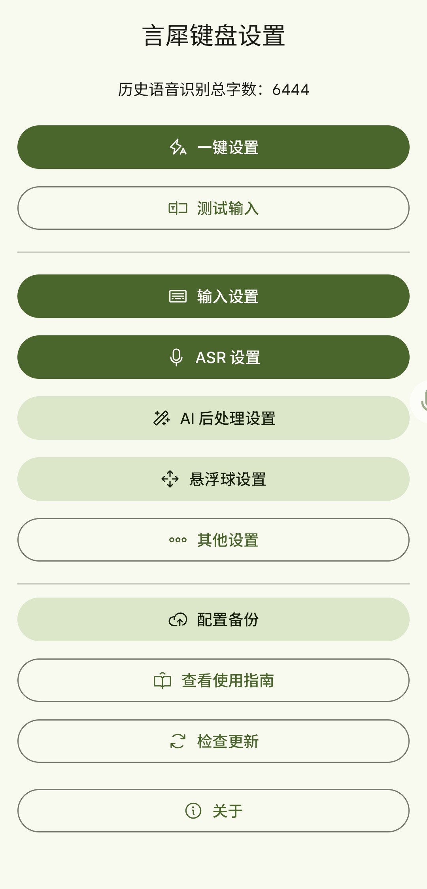
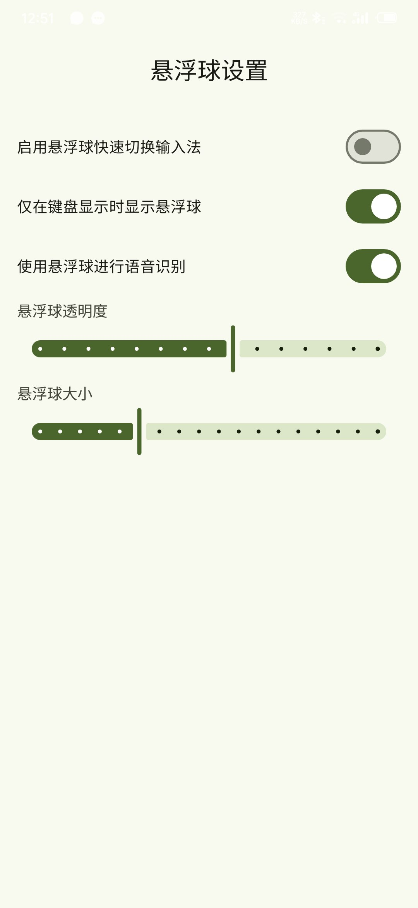
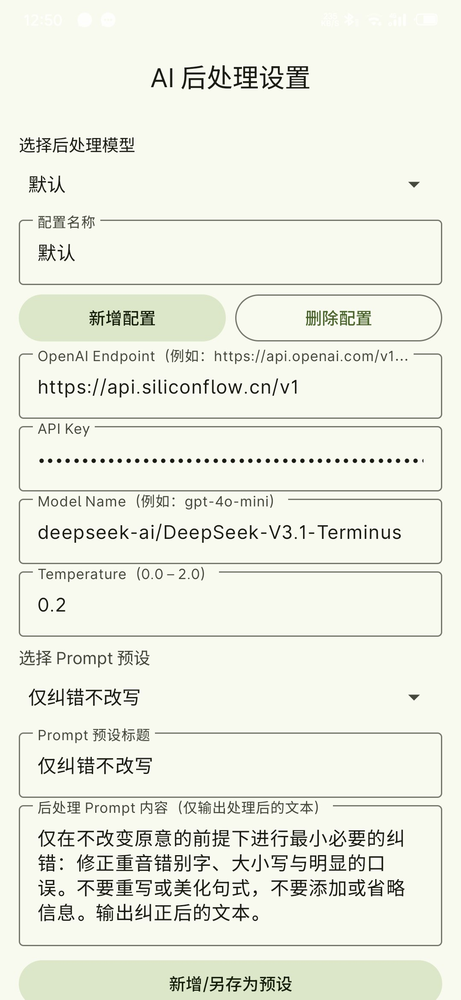
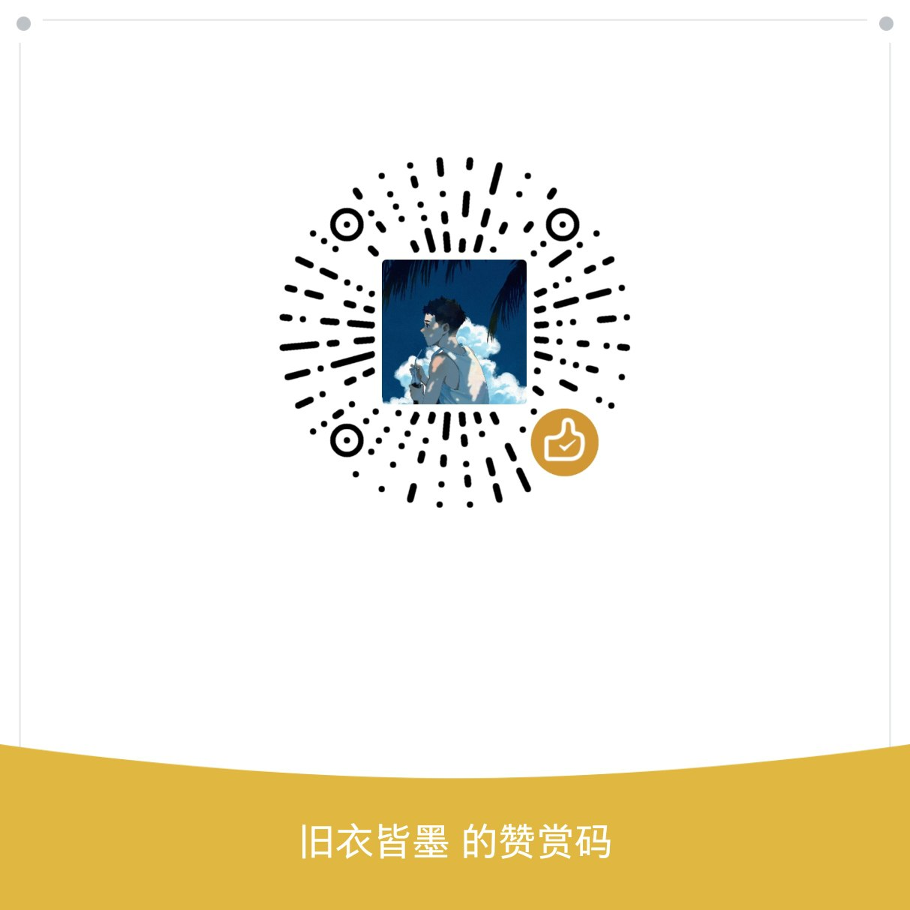

<div align="center">

# 🎙️ 言犀键盘 (LexiSharp Keyboard)

**基于 AI 的智能语音输入法 | 让语音输入更自然、更高效**

简体中文 | [English](README_EN.md)

[](https://opensource.org/licenses/MIT)
[](https://www.android.com/)
[](https://kotlinlang.org/)
[](https://t.me/+SqgKaDglg540YjIx)

[功能特性](#-功能特性) • [快速开始](#-快速开始) • [使用指南](#-使用指南) • [配置说明](#-配置说明) • [技术架构](#-技术架构)

</div>

---

## ✨ 功能特性

<table>
<tr>
<td width="50%">

### 🎤 语音识别

- **长按录音** - 简单直观的录音操作
- **极速识别** - 松开即上传，快速返回结果
- **多引擎支持** - 7+ 主流 ASR 服务
- **AI 文本后处理** - LLM 后处理修正识别结果

</td>
<td width="50%">

### 🟣 悬浮球输入 ⭐

- **跨输入法使用** - 任何输入法都能语音输入
- **无缝集成** - 保持原有输入习惯
- **自动插入** - 识别结果自动填入
- **视觉反馈** - 录音/处理状态一目了然

</td>
</tr>
<tr>
<td width="50%">

### 📝 智能输入

- **拼音输入** - 全拼 + 小鹤双拼
- **LLM 转换** - AI 智能拼音转汉字
- **AI 编辑** - 语音指令编辑文本
- **自定义按键** - 个性化标点符号

</td>
<td width="50%">

### 🎨 用户体验

- **Material3 设计** - 现代化界面风格，Monet 色彩适配
- **多语言支持** - 中英文快速切换
- **统计功能** - 识别字数统计
- **振动反馈** - 按下麦克风时振动反馈

</td>
</tr>
</table>

---

## 📱 UI 展示

<table>
<tr>
<td width="50%" align="center">

<br/>
<b>🎹 键盘视图</b>
<br/>
<sub>简洁的键盘界面，支持语音输入、键盘切换和自定义按键</sub>
</td>
<td width="50%" align="center">

<br/>
<b>⚙️ 设置界面</b>
<br/>
<sub>丰富的配置选项，支持多种 ASR 引擎和 LLM 后处理</sub>
</td>
</tr>
<tr>
<td width="50%" align="center">

<br/>
<b>🟣 悬浮球功能</b>
<br/>
<sub>跨输入法语音识别，随时随地语音输入</sub>
</td>
<td width="50%" align="center">

<br/>
<b>🤖 AI 后处理</b>
<br/>
<sub>LLM 智能优化识别结果，提升文本质量</sub>
</td>
</tr>
</table>

---

## 🚀 快速开始

### 📋 系统要求

- Android 7.0 (API 24) 或更高版本
- 麦克风权限（语音识别）
- 悬浮窗权限（可选，用于悬浮球功能）
- 无障碍权限（可选，用于自动插入文本）

### 📥 安装步骤

1. **下载安装**

   - 从 [Releases](../../releases) 页面下载最新版本 APK
   - 安装到 Android 设备

2. **启用输入法**

   ```
   设置 → 系统 → 语言和输入法 → 虚拟键盘 → 管理键盘 → 启用"言犀键盘"
   ```

3. **配置 ASR 服务**

   - 打开言犀键盘设置
   - 选择 ASR 供应商（推荐：火山引擎）
   - 填入 API 密钥

4. **开始使用**
   - 在任意输入框切换到言犀键盘
   - 长按麦克风按钮开始语音输入

> 💡 **提示**: 首次使用建议先配置火山引擎，可获得 20 小时免费额度！

---

## 📖 使用指南

### 🎤 语音输入功能

<details>
<summary><b>基本操作</b></summary>

1. 长按键盘中央的麦克风按钮开始录音
2. 松开按钮后，音频会自动上传到所选的 ASR 服务进行识别
3. 识别结果会自动插入到当前输入框

</details>

<details>
<summary><b>AI 编辑功能</b></summary>

1. 点击键盘上的编辑按钮（AI 图标）
2. 语音输入编辑指令（如"删除最后一个词"、"将'你好'改为'您好'"等）
3. 说完指令后再按一次编辑按钮，AI 会根据指令修改上次识别的文本或选中内容

</details>

### 📝 LLM 拼音输入功能

<details>
<summary><b>拼音输入模式</b></summary>

- 在键盘上正常输入拼音（支持全拼和小鹤双拼）
- 输入完成后，系统会自动调用 LLM 将拼音转换为对应的汉字
- 可在设置中调整自动 LLM 转换的时间间隔（默认为 0 表示手动触发）

**示例**：

- 全拼：输入 `nihao` → LLM 转换为 `你好`
- 小鹤双拼：支持双拼输入方案

</details>

### ⌨️ 键盘按钮功能

<details>
<summary><b>主要按钮布局</b></summary>

| 按钮      | 功能                | 特殊操作                    |
| --------- | ------------------- | --------------------------- |
| 🎤 麦克风 | 长按进行语音识别    | -                           |
| 🤖 后处理 | 开启/关闭 AI 后处理 | -                           |
| 💬 提示词 | 切换 AI 提示词预设  | -                           |
| ⬇️ 收起   | 隐藏键盘界面        | -                           |
| ⌫ 退格    | 删除字符            | 上滑/左滑删除全部，下滑撤销 |
| ⚙️ 设置   | 进入设置界面        | -                           |
| 🔄 切换   | 切换到其他输入法    | -                           |
| ↵ 回车    | 换行或提交          | -                           |

</details>

<details>
<summary><b>自定义按键</b></summary>

- 键盘底部有 **5 个可自定义**的标点符号按钮
- 可在设置中自定义每个按钮显示的字符或标点
- 支持添加常用符号：`,` `.` `?` `!` `;` 等

</details>

### 🟣 悬浮球语音识别功能 ⭐

> **杀手级功能**：完美解决语音输入与常规输入法配合使用的痛点！

<details open>
<summary><b>功能亮点</b></summary>

#### 🌐 跨输入法语音输入

- 无论当前使用哪个输入法（搜狗、百度、Gboard 等），都能通过悬浮球进行语音输入
- 无需频繁切换输入法，保持原有输入习惯的同时享受高质量语音识别
- 识别结果自动插入到当前输入框，无缝衔接

#### 💼 使用场景

| 场景          | 说明                                                     |
| ------------- | -------------------------------------------------------- |
| 💬 日常聊天   | 使用熟悉的输入法打字，需要长段文字时点击悬浮球语音输入   |
| 📄 文档编辑   | 既能用常规输入法输入格式化内容，又能快速语音录入大段文字 |
| 🌍 多语言输入 | 保持原输入法的多语言支持，同时获得高质量中文语音识别     |
| ⚡ 效率提升   | 打字和语音输入随时切换，大幅提升输入效率                 |

#### 🎯 操作流程

```
1. 设置中开启"使用悬浮球进行语音识别"
2. 授予悬浮窗权限和无障碍权限
3. 悬浮球始终显示在屏幕上（可调节透明度和大小）
4. 长按拖动悬浮球调整位置
5. 点击悬浮球开始录音，再次点击停止
6. 识别结果自动插入到当前输入框
```

#### 🎨 视觉反馈

- 🔘 **空闲状态**：麦克风图标显示为灰色
- 🔴 **录音中**：图标变为红色
- 🔵 **AI 处理中**：图标变为蓝色

</details>

<details>
<summary><b>与输入法切换悬浮球的区别</b></summary>

| 类型                | 用途                       | 适用场景                 |
| ------------------- | -------------------------- | ------------------------ |
| 🔄 输入法切换悬浮球 | 快速切换回言犀键盘         | 需要使用本应用键盘功能时 |
| 🎤 语音识别悬浮球   | 在任何输入法下进行语音输入 | 日常混合使用场景         |

> ⚠️ **注意**：两种模式互斥，开启语音识别悬浮球后，输入法切换悬浮球会自动隐藏

</details>

<details>
<summary><b>推荐配置方案</b></summary>

```
✅ 将常用的第三方输入法设为默认输入法（如搜狗、百度等）
✅ 开启言犀键盘的悬浮球语音识别功能，使用非流式识别，流式识别仅火山引擎支持，并且处于早期阶段
✅ 日常使用第三方输入法打字，需要语音输入时点击悬浮球
✅ 享受两全其美的输入体验：熟悉的打字手感 + 高质量的语音识别
✅ 需要时切换到言犀键盘，享受更多智能 ASR 功能
```

</details>

---

## ⚙️ 配置说明

### 🎯 ASR 供应商选择与配置

设置页支持按供应商切换配置，所选供应商仅显示对应参数。

<table>
<tr>
<td width="50%">

#### 🌋 火山引擎（推荐）

**免费额度**: 20 小时

**配置参数**:

- `X-Api-App-Key`: 应用 ID
- `X-Api-Access-Key`: Access Token

**申请方式**: [火山引擎控制台](https://console.volcengine.com/speech/app?opt=create)

</td>
<td width="50%">

#### 🤖 OpenAI

**支持模型**:

- `gpt-4o-mini-transcribe`
- `gpt-4o-transcribe`
- `whisper-1`

**配置参数**:

- `API Key`: 以 `sk-` 开头
- `Endpoint`: API 地址
- `Model`: 模型名称

> ⚠️ 单次上传上限 25MB

</td>
</tr>
<tr>
<td width="50%">

#### 💎 SiliconFlow

**默认模型**: `FunAudioLLM/SenseVoiceSmall`

**配置参数**:

- `API Key`: Bearer Token
- `Model Name`: 模型名称

**端点**: `https://api.siliconflow.cn/v1/audio/transcriptions`

</td>
<td width="50%">

#### 🎵 ElevenLabs

**配置参数**:

- `API Key`: API 密钥
- `Model ID`: 模型 ID

**端点**: `https://api.elevenlabs.io/v1/speech-to-text`

</td>
</tr>
<tr>
<td width="50%">

#### ☁️ 阿里云百炼

**支持模型**: `qwen3-asr-flash`

**配置参数**:

- `API Key`: API 密钥
- `Model`: 模型名称

> 📝 采用 OSS 中转，延迟稍高

</td>
<td width="50%">

#### 🔮 Google Gemini

**配置参数**:

- `API Key`: API 密钥
- `Model`: 模型名称

**特点**: 通过提示词进行语音理解

</td>
</tr>
<tr>
<td width="50%">

#### 🎯 Soniox

**支持模式**:

- 文件识别: `stt-async-preview`
- 流式识别: `stt-rt-preview`

**配置参数**:

- `API Key`: API 密钥

**端点**:

- 文件上传: `https://api.soniox.com/v1/files`
- 转写接口: `https://api.soniox.com/v1/transcriptions`
- WebSocket: `wss://stt-rt.soniox.com/transcribe-websocket`

> 📝 非流式识别采用官方中转，延迟稍高

</td>
<td width="50%">

</td>
</tr>
</table>

### 🧠 LLM 后处理配置

<details>
<summary><b>配置参数</b></summary>

| 参数       | 说明                 | 示例                                         |
| ---------- | -------------------- | -------------------------------------------- |
| API 密钥   | LLM 服务的 API 密钥  | `sk-xxx...`                                  |
| 服务端点   | LLM API 地址         | `https://api.openai.com/v1/chat/completions` |
| 模型名称   | 使用的 LLM 模型      | `gpt-4o-mini`                                |
| 温度参数   | 控制生成文本的随机性 | `0.0 - 2.0`                                  |
| 提示词预设 | 多种预设提示词       | 可自定义添加                                 |
| 自动后处理 | 自动后处理开关       | 开启/关闭                                    |

</details>

### 🎛️ 其他功能配置

<details>
<summary><b>输入设置</b></summary>

- **拼音输入**: 全拼 / 小鹤双拼
- **自动转换**: 拼音自动转换时间间隔
- **自定义按键**: 5 个自定义标点符号按键

</details>

<details>
<summary><b>悬浮球设置</b></summary>

- **语音识别悬浮球**: 透明度、大小调节
- **输入法切换悬浮球**: 快速切换功能

</details>

<details>
<summary><b>体验设置</b></summary>

- **振动反馈**: 麦克风 / 键盘按键振动
- **语言设置**: 跟随系统 / 简体中文 / 英文

</details>

---

<details>
<summary><h2>🔧 技术架构</h2></summary>

### 📦 核心组件

<details>
<summary><b>ASR 引擎层</b></summary>

- `AsrEngine.kt` - ASR 引擎基础接口
- `AsrVendor.kt` - ASR 供应商枚举
- `VolcFileAsrEngine.kt` - 火山引擎实现
- `OpenAiFileAsrEngine.kt` - OpenAI Whisper 实现
- `SiliconFlowFileAsrEngine.kt` - SiliconFlow 实现
- `ElevenLabsFileAsrEngine.kt` - ElevenLabs 实现
- `DashscopeFileAsrEngine.kt` - 阿里云百炼实现
- `GeminiFileAsrEngine.kt` - Google Gemini 实现
- `SonioxFileAsrEngine.kt` - Soniox 文件识别实现
- `SonioxStreamAsrEngine.kt` - Soniox 流式识别实现
- `LlmPostProcessor.kt` - LLM 后处理器

</details>

<details>
<summary><b>输入法服务层</b></summary>

- `AsrKeyboardService.kt` - 主键盘服务 (InputMethodService)
- `FloatingAsrService.kt` - 悬浮球语音识别服务
- `FloatingImeSwitcherService.kt` - 悬浮输入法切换服务
- `AsrAccessibilityService.kt` - 无障碍服务（文本插入）

</details>

<details>
<summary><b>用户界面层</b></summary>

- `SettingsActivity.kt` - 设置界面
- `PermissionActivity.kt` - 权限请求界面
- `ImePickerActivity.kt` - 输入法选择器

</details>

<details>
<summary><b>数据存储层</b></summary>

- `Prefs.kt` - 运行时配置管理
- `PromptPreset.kt` - 提示词预设管理

</details>

### 🎨 技术栈

```
Kotlin 1.9.24
Android SDK 34 (Min SDK 24)
Material Design 3
Coroutines (异步处理)
OkHttp (网络请求)
SharedPreferences (数据存储)
```

### 🔊 音频处理

```
格式: PCM 16kHz / 16-bit / Mono
编码: WAV 封装
传输: HTTP/HTTPS
压缩: 支持 GZIP
```

</details>

---

## 📄 许可证

本项目采用 **MIT 许可证**，详见 [LICENSE](LICENSE) 文件。

```
MIT License - 自由使用、修改、分发
```

---

<details>
<summary><h2>🤝 贡献指南</h2></summary>

欢迎提交 Issue 和 Pull Request 来改进项目！

### 提交代码前请确保：

- ✅ 代码通过所有测试
- ✅ 遵循项目代码规范（Kotlin 标准）
- ✅ 添加必要的注释和文档
- ✅ 更新相关的 README 文档
- ✅ 使用 Conventional Commits 格式

</details>

---

## 🌟 Star History

如果这个项目对你有帮助，请给个 Star ⭐️

---

## 💬 社区交流

欢迎加入我们的 Telegram 群组,与其他用户交流使用心得、反馈问题或提出建议!

<div align="center">

[](https://t.me/+SqgKaDglg540YjIx)

</div>

---

## ☕ 赞赏支持

如果这个项目对你有帮助，欢迎请我喝杯咖啡 ☕️

<div align="center">

<br/>
<sub>微信扫码赞赏</sub>
</div>

---

<div align="center">

**Made with ❤️ by BryceWG**

</div>
