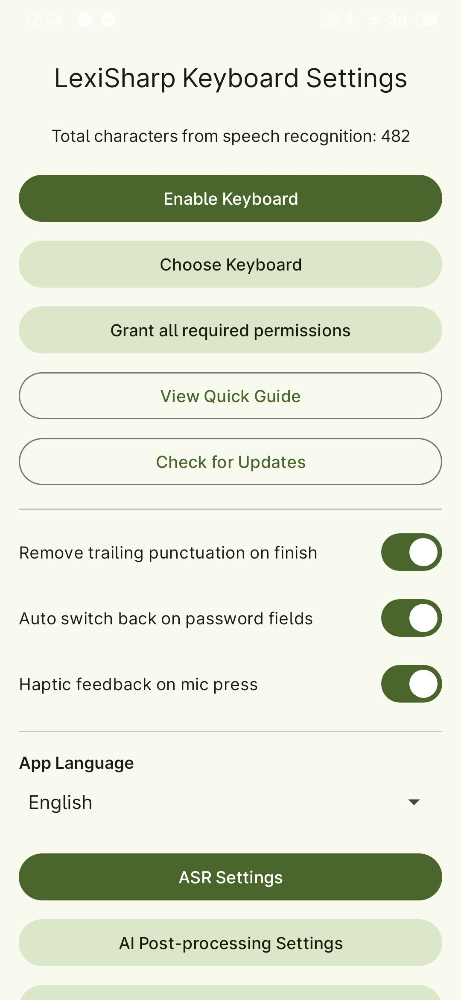
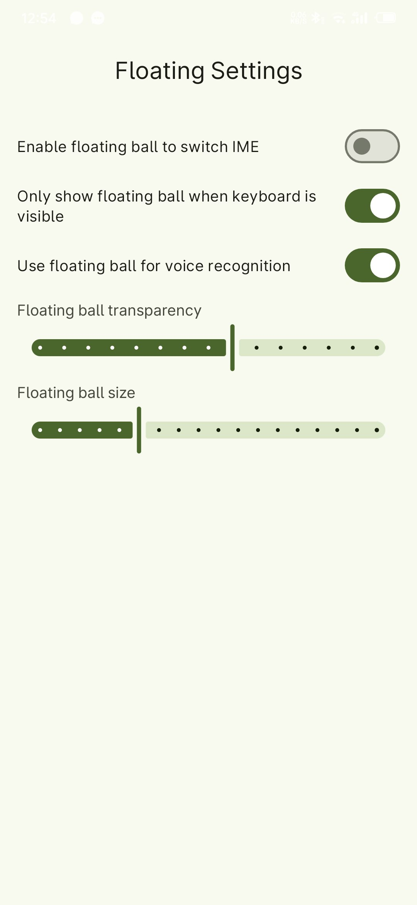
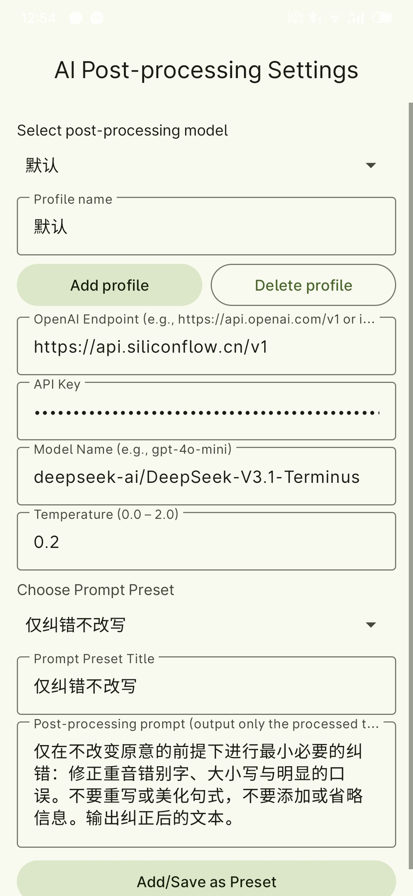

<div align="center">

# 🎙️ LexiSharp Keyboard

**AI-powered Smart Voice Input Method | Make Voice Input More Natural and Efficient**

English | [简体中文](README.md)

[](https://opensource.org/licenses/MIT)
[](https://www.android.com/)
[](https://kotlinlang.org/

[Features](#-features) • [Quick Start](#-quick-start) • [User Guide](#-user-guide) • [Configuration](#-configuration) • [Architecture](#-architecture)

</div>

---

## ✨ Features

<table>
<tr>
<td width="50%">

### 🎤 Voice Recognition

- **Press & Hold Recording** - Simple and intuitive recording
- **Fast Recognition** - Release to upload, quick results
- **Multi-Engine Support** - 7+ mainstream ASR services
- **AI Text Optimization** - LLM smart correction of recognition results

</td>
<td width="50%">

### 🟣 Floating Ball Input ⭐

- **Cross-IME Usage** - Voice input with any input method
- **Seamless Integration** - Maintain your original typing habits
- **Auto Insertion** - Recognition results automatically inserted
- **Visual Feedback** - Clear recording/processing status

</td>
</tr>
<tr>
<td width="50%">

### 📝 Smart Input

- **Pinyin Input** - Full Pinyin + Xiaohe Shuangpin
- **LLM Conversion** - AI smart Pinyin to Chinese conversion
- **AI Editing** - Voice commands for text editing
- **Custom Keys** - Personalized punctuation keys

</td>
<td width="50%">

### 🎨 User Experience

- **Material3 Design** - Modern interface style with Monet color adaptation
- **Multi-language Support** - Quick switching between Chinese and English
- **Statistics** - Recognition character count
- **Vibration Feedback** - Customizable feedback intensity

</td>
</tr>
</table>

---

## � UI Showcase

<table>
<tr>
<td width="50%" align="center">

<br/>
<b>🎹 Keyboard View</b>
<br/>
<sub>Clean keyboard interface with voice input, IME switching, and custom keys</sub>
</td>
<td width="50%" align="center">

<br/>
<b>⚙️ Settings Interface</b>
<br/>
<sub>Rich configuration options with multiple ASR engines and LLM post-processing</sub>
</td>
</tr>
<tr>
<td width="50%" align="center">

<br/>
<b>🟣 Floating Ball Feature</b>
<br/>
<sub>Cross-IME voice recognition, voice input anytime, anywhere</sub>
</td>
<td width="50%" align="center">

<br/>
<b>🤖 AI Post-Processing</b>
<br/>
<sub>LLM intelligently optimizes recognition results to improve text quality</sub>
</td>
</tr>
</table>

---

## �🚀 Quick Start

### 📋 System Requirements

- Android 7.0 (API 24) or higher
- Microphone permission (for voice recognition)
- Overlay permission (optional, for floating ball feature)
- Accessibility permission (optional, for automatic text insertion)

### 📥 Installation Steps

1. **Download & Install**

   - Download the latest APK from [Releases](../../releases) page
   - Install on your Android device

2. **Enable Input Method**

   ```
   Settings → System → Language & Input → Virtual Keyboard → Manage Keyboards → Enable "LexiSharp Keyboard"
   ```

3. **Configure ASR Service**

   - Open LexiSharp Keyboard settings
   - Select ASR vendor (recommended: Volcengine)
   - Enter your API key

4. **Start Using**

   - Switch to LexiSharp Keyboard in any input field
   - Long press the microphone button to start voice input

> 💡 **Tip**: First-time users are recommended to configure Volcengine for 20 hours of free quota!

---

## 📖 User Guide

### 🎤 Voice Input Feature

<details>
<summary><b>Basic Operations</b></summary>

1. Long press the microphone button in the center of the keyboard to start recording
2. Release the button, and the audio will be automatically uploaded to the selected ASR service for recognition
3. Recognition results will be automatically inserted into the current input field

</details>

<details>
<summary><b>AI Editing Feature</b></summary>

1. Click the edit button on the keyboard (AI icon)
2. Speak editing commands (e.g., "delete the last word", "change 'hello' to 'hi'", etc.)
3. After speaking the command, press the edit button again, and AI will modify the previously recognized text or selected content based on the command

</details>

### 📝 LLM Pinyin Input Feature

<details>
<summary><b>Pinyin Input Mode</b></summary>

- Type Pinyin normally on the keyboard (supports full Pinyin and Xiaohe Shuangpin)
- After input is complete, the system will automatically call LLM to convert Pinyin to corresponding Chinese characters
- You can adjust the automatic LLM conversion time interval in settings (default is 0 for manual trigger)

**Examples**:

- Full Pinyin: input `nihao` → LLM converts to `你好`
- Xiaohe Shuangpin: supports double Pinyin input scheme

</details>

### ⌨️ Keyboard Button Functions

<details>
<summary><b>Main Button Layout</b></summary>

| Button      | Function                | Special Operations                        |
| ----------- | ----------------------- | ----------------------------------------- |
| 🎤 Mic      | Long press for voice    | -                                         |
| 🤖 Post     | Toggle AI post-process  | -                                         |
| 💬 Prompt   | Switch AI prompt preset | -                                         |
| ⬇️ Hide     | Hide keyboard           | -                                         |
| ⌫ Back      | Delete characters       | Swipe up/left to delete all, down to undo |
| ⚙️ Settings | Enter settings          | -                                         |
| 🔄 Switch   | Switch to other IME     | -                                         |
| ↵ Enter     | New line or submit      | -                                         |

</details>

<details>
<summary><b>Custom Keys</b></summary>

- There are **5 customizable** punctuation buttons at the bottom of the keyboard
- You can customize the character or punctuation displayed on each button in settings
- Support adding common symbols: `,` `.` `?` `!` `;` etc.

</details>

### 🟣 Floating Ball Voice Recognition Feature ⭐

> **Killer Feature**: Perfectly solves the pain point of voice input working with regular input methods!

<details open>
<summary><b>Feature Highlights</b></summary>

#### 🌐 Cross-IME Voice Input

- Regardless of which input method you're currently using (Sogou, Baidu, Gboard, etc.), you can use voice input through the floating ball
- No need to frequently switch input methods, enjoy high-quality voice recognition while maintaining your original typing habits
- Recognition results are automatically inserted into the current input field for seamless integration

#### 💼 Use Cases

| Scenario                | Description                                                                                     |
| ----------------------- | ----------------------------------------------------------------------------------------------- |
| 💬 Daily Chat           | Use familiar input methods for typing, click floating ball for long text input                  |
| 📄 Document Editing     | Use regular input methods for formatted content, quick voice input for long paragraphs          |
| 🌍 Multi-language Input | Maintain your IME's multi-language support while getting high-quality Chinese voice recognition |
| ⚡ Efficiency Boost     | Switch between typing and voice input anytime, greatly improving input efficiency               |

#### 🎯 Operation Flow

```
1. Enable "Use Floating Ball for Voice Recognition" in settings
2. Grant overlay permission and accessibility permission
3. Floating ball always displays on screen (adjustable transparency and size)
4. Long press and drag to adjust floating ball position
5. Click floating ball to start recording, click again to stop
6. Recognition results are automatically inserted into current input field
```

#### 🎨 Visual Feedback

- 🔘 **Idle State**: Microphone icon shows in gray
- 🔴 **Recording**: Icon turns red
- 🔵 **AI Processing**: Icon turns blue

</details>

<details>
<summary><b>Difference from IME Switching Floating Ball</b></summary>

| Type                      | Purpose                          | Applicable Scenarios                              |
| ------------------------- | -------------------------------- | ------------------------------------------------- |
| 🔄 IME Switch Ball        | Quickly switch back to LexiSharp | When you need to use this app's keyboard features |
| 🎤 Voice Recognition Ball | Voice input with any IME         | Daily mixed usage scenarios                       |

> ⚠️ **Note**: The two modes are mutually exclusive. When the voice recognition floating ball is enabled, the IME switching floating ball will be automatically hidden

</details>

<details>
<summary><b>Recommended Configuration</b></summary>

```
✅ Set your frequently used third-party IME as default (Sogou, Baidu, etc.)
✅ Enable LexiSharp Keyboard's floating ball voice recognition, use non-streaming recognition. Streaming recognition is only supported by Volcengine and is in early stages
✅ Use third-party IME for daily typing, click floating ball when voice input is needed
✅ Enjoy the best of both worlds: familiar typing experience + high-quality voice recognition
✅ Switch to LexiSharp Keyboard when needed for more smart ASR features
```

</details>

---

## ⚙️ Configuration

### 🎯 ASR Vendor Selection & Configuration

The settings page supports configuration switching by vendor, showing only corresponding parameters for the selected vendor.

<table>
<tr>
<td width="50%">

#### 🌋 Volcengine (Recommended)

**Free Quota**: 20 hours

**Configuration Parameters**:

- `X-Api-App-Key`: Application ID
- `X-Api-Access-Key`: Access Token

**Application**: [Volcengine Console](https://console.volcengine.com/speech/app?opt=create)

</td>
<td width="50%">

#### 🤖 OpenAI

**Supported Models**:

- `gpt-4o-mini-transcribe`
- `gpt-4o-transcribe`
- `whisper-1`

**Configuration Parameters**:

- `API Key`: Starts with `sk-`
- `Endpoint`: API address
- `Model`: Model name

> ⚠️ Single upload limit: 25MB

</td>
</tr>
<tr>
<td width="50%">

#### 💎 SiliconFlow

**Default Model**: `FunAudioLLM/SenseVoiceSmall`

**Configuration Parameters**:

- `API Key`: Bearer Token
- `Model Name`: Model name

**Endpoint**: `https://api.siliconflow.cn/v1/audio/transcriptions`

</td>
<td width="50%">

#### 🎵 ElevenLabs

**Configuration Parameters**:

- `API Key`: API key
- `Model ID`: Model ID

**Endpoint**: `https://api.elevenlabs.io/v1/speech-to-text`

</td>
</tr>
<tr>
<td width="50%">

#### ☁️ Alibaba Cloud Bailian

**Supported Model**: `qwen3-asr-flash`

**Configuration Parameters**:

- `API Key`: API key
- `Model`: Model name

> 📝 Uses OSS relay, slightly higher latency

</td>
<td width="50%">

#### 🔮 Google Gemini

**Configuration Parameters**:

- `API Key`: API key
- `Model`: Model name

**Feature**: Voice understanding through prompts

</td>
</tr>
<tr>
<td width="50%">

#### 🎯 Soniox

**Supported Modes**:

- File Recognition: `stt-async-preview`
- Streaming Recognition: `stt-rt-preview`

**Configuration Parameters**:

- `API Key`: API key

**Endpoints**:

- File Upload: `https://api.soniox.com/v1/files`
- Transcription: `https://api.soniox.com/v1/transcriptions`
- WebSocket: `wss://stt-rt.soniox.com/transcribe-websocket`

> 📝 Non-streaming mode Uses OSS relay, slightly higher latency

</td>
<td width="50%">

</td>
</tr>
</table>

### 🧠 LLM Post-Processing Configuration

<details>
<summary><b>Configuration Parameters</b></summary>

| Parameter         | Description                          | Example                                      |
| ----------------- | ------------------------------------ | -------------------------------------------- |
| API Key           | LLM service API key                  | `sk-xxx...`                                  |
| Service Endpoint  | LLM API address                      | `https://api.openai.com/v1/chat/completions` |
| Model Name        | LLM model to use                     | `gpt-4o-mini`                                |
| Temperature       | Control randomness of generated text | `0.0 - 2.0`                                  |
| Prompt Presets    | Multiple preset prompts              | Customizable                                 |
| Auto Post-Process | Automatic post-processing toggle     | Enable/Disable                               |

</details>

### 🎛️ Other Feature Configurations

<details>
<summary><b>Input Settings</b></summary>

- **Pinyin Input**: Full Pinyin / Xiaohe Shuangpin
- **Auto Conversion**: Pinyin auto-conversion time interval
- **Custom Keys**: 5 customizable punctuation keys

</details>

<details>
<summary><b>Floating Ball Settings</b></summary>

- **Voice Recognition Ball**: Transparency, size adjustment
- **IME Switching Ball**: Quick switching function

</details>

<details>
<summary><b>Experience Settings</b></summary>

- **Vibration Feedback**: Microphone / keyboard button vibration
- **Language Settings**: Follow system / Simplified Chinese / English

</details>

---

## 🔧 Technical Architecture

### 📦 Core Components

<details>
<summary><b>ASR Engine Layer</b></summary>

- `AsrEngine.kt` - ASR engine base interface
- `AsrVendor.kt` - ASR vendor enumeration
- `VolcFileAsrEngine.kt` - Volcengine implementation
- `OpenAiFileAsrEngine.kt` - OpenAI Whisper implementation
- `SiliconFlowFileAsrEngine.kt` - SiliconFlow implementation
- `ElevenLabsFileAsrEngine.kt` - ElevenLabs implementation
- `DashscopeFileAsrEngine.kt` - Alibaba Cloud Bailian implementation
- `GeminiFileAsrEngine.kt` - Google Gemini implementation
- `SonioxFileAsrEngine.kt` - Soniox file recognition implementation
- `SonioxStreamAsrEngine.kt` - Soniox streaming recognition implementation
- `LlmPostProcessor.kt` - LLM post-processor

</details>

<details>
<summary><b>Input Method Service Layer</b></summary>

- `AsrKeyboardService.kt` - Main keyboard service (InputMethodService)
- `FloatingAsrService.kt` - Floating ball voice recognition service
- `FloatingImeSwitcherService.kt` - Floating IME switching service
- `AsrAccessibilityService.kt` - Accessibility service (text insertion)

</details>

<details>
<summary><b>User Interface Layer</b></summary>

- `SettingsActivity.kt` - Settings interface
- `PermissionActivity.kt` - Permission request interface
- `ImePickerActivity.kt` - Input method picker

</details>

<details>
<summary><b>Data Storage Layer</b></summary>

- `Prefs.kt` - Runtime configuration management
- `PromptPreset.kt` - Prompt preset management

</details>

### 🎨 Tech Stack

```
Kotlin 1.9.24
Android SDK 34 (Min SDK 24)
Material Design 3
Coroutines (async processing)
OkHttp (network requests)
SharedPreferences (data storage)
```

### 🔊 Audio Processing

```
Format: PCM 16kHz / 16-bit / Mono
Encoding: WAV container
Transmission: HTTP/HTTPS
Compression: GZIP support
```

---

## 📄 License

This project is licensed under the **MIT License**, see the [LICENSE](LICENSE) file for details.

```
MIT License - Free to use, modify, distribute
```

---

## 🤝 Contributing

Welcome to submit Issues and Pull Requests to improve the project!

### Please ensure before submitting code:

- ✅ Code passes all tests
- ✅ Follow project coding standards (Kotlin standards)
- ✅ Add necessary comments and documentation
- ✅ Update relevant README documentation
- ✅ Use Conventional Commits format

---

## 🌟 Star History

If this project helps you, please give it a Star ⭐️

---

<div align="center">

**Made with ❤️ by BryceWG**

</div>
